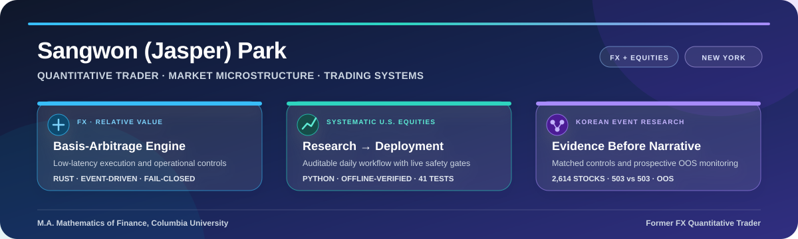

  

  <strong>M.A. in Mathematics of Finance, Columbia University</strong>
  &nbsp;·&nbsp;
  <strong>Former FX Quantitative Trader</strong>

  <a href="https://github.com/swp0569/basis-arbitrage-engine"><strong>Basis-Arbitrage Engine</strong></a>
  &nbsp;·&nbsp;
  <a href="https://github.com/swp0569/systematic-equity-trading-system"><strong>Systematic U.S.-Equity System</strong></a>
  &nbsp;·&nbsp;
  <a href="https://github.com/swp0569/kr-catalyst-monitor-showcase"><strong>Korean Event Research</strong></a>

I build research-to-production trading workflows across FX and equities, with emphasis on market
microstructure, execution, data integrity, reconciliation, and risk controls. My public work spans
low-latency Rust systems, systematic Python research, matched-control studies, and prospective
out-of-sample monitoring.

**Core stack:** Python · Rust · SQL · R · Linux · Git · Bloomberg Terminal 
**Writing:** Daily SPX volatility notes at [GammaMacro](https://gammamacro.substack.com/) — dealer gamma, options positioning, CTA flow, and VIX term structure 
**Contact:** [p.sangwon@columbia.edu](mailto:p.sangwon@columbia.edu)

Public repositories are intentionally sanitized and contain no employer code, confidential data, live credentials, production configuration, or proprietary trading parameters.
